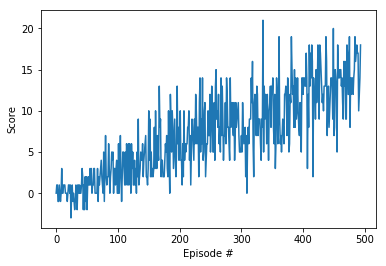

# Report

### Table of Contents

1. [Learning Algorithm](#learningAlgo)
2. [Training Results](#trainingResults)
3. [Future Work](#futureWork)


### Learning Algorithm <a name="learningAlgo"></a>

The Deep Q-learning based agent used in this project consists of 4 fully connected layers with RELU activation layers. Each layer has a length of 64 nodes. The Deep Q-learning uses Epsilon Greedy algorithm to define the parameters for exploration and exploitation. The hyperparameter \epsilon was set to `1.0` till it reached `0.01` with eps_decay of `0.995`.

Experience replay allows the RL agent to learn from past experience. Each experience is stored in a replay buffer as the agent interacts with the environment. The replay buffer contains a collection of experience tuples with the state, action, reward, and next state (s, a, r, s') which the agent  samples from this buffer as part of the learning step. 

Complete code of the Q-Network and Replay can be found in dql_agent.py and model.py

Rest of the hyperparameters used in the code for training are shown below

```
BUFFER_SIZE = int(1e5)  # replay buffer size
BATCH_SIZE = 64         # minibatch size
GAMMA = 0.99            # discount factor
TAU = 1e-3              # for soft update of target parameters
LR = 5e-4               # learning rate 
```

### Training Results <a name="trainingResults"></a>
The agent was able to achieve the given target with average score of 13 in 394 episodes. The learning curve and episodes are show below. The resulting model is saved as `checkpoint.pth`


```
Episode 100	Average Score: 1.07
Episode 200	Average Score: 4.41
Episode 300	Average Score: 7.71
Episode 400	Average Score: 9.50
Episode 494	Average Score: 13.07
Environment solved in 394 episodes!	Average Score: 13.07
```



### Future Work <a name="futureWork"></a>

* Prioritized experience replay — Rather than selecting experience tuples randomly, we can select the entry from replay buffer in prioritized way. This can improve learning by increasing the probability that rare and important experience vectors are sampled and help the agent learn better.

* Rainbow - We can implement this algorithm as it includes all the improvements for the Deep Q-Learning. This can improve the over all learning of the algorithm.
